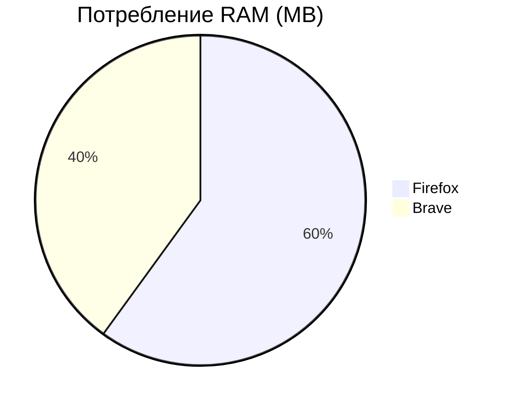

# Сравнительный анализ браузеров: Firefox vs Brave 

## Цель 

Провести сравнительный анализ браузеров Firefox и Brave для оценки их производительности, совместимости, безопасности и энергопотребления. 

## Методология 

Использовались следующие методы для оценки каждого критерия: 

* **Потребление RAM:** Измерение через Task Manager при открытии 10 одинаковых вкладок. 
* **HTML5-совместимость:** Проверка через [HTML5Test.com](https://html5test.com). 
* **Безопасность:** Оценка по рейтингу Tranco List (чем ниже, тем безопаснее). 
* **Энергопотребление:** Анализ Battery Report в Windows (средний расход за час работы). 

## Результаты 

### Таблица с сырыми данными 

| Критерий | Firefox | Brave | Примечания | 
|-------------------------------|-------------|-----------|-------------------------------------------------------------| 
| Потребление RAM (10 вкладок) | 1800 MB | 1200 MB | Среднее значение после 5 мин. работы | 
| HTML5Test баллы | 510 | 528 | Максимум — 555, больше = лучше | 
| Tranco Rank (↓ безопаснее) | 35 | 28 | Среднее значение из 5 попыток, ниже — лучше | 
| Энергопотребление | -8% | -5% | Снижение заряда за 1 час, меньше = экономичнее | 

## Графики (Mermaid-диаграммы) 

Потребление RAM:

